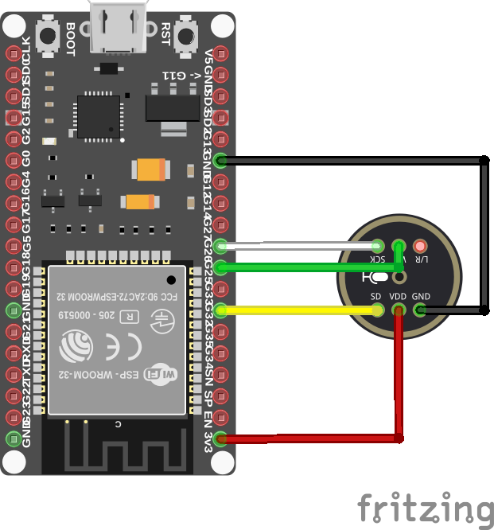
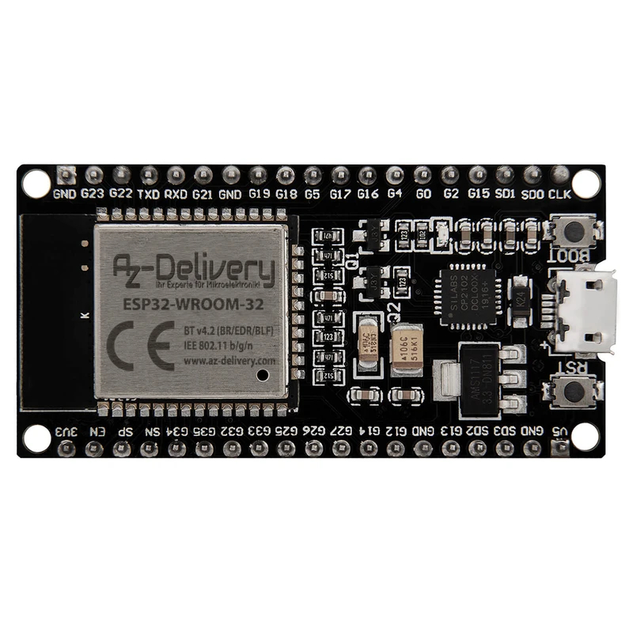
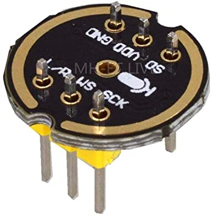

# ESP32-BUG-I2S-MIC

Simple project for live audio streaming and recording from an I2S MEMS microphone (INMP441) over UDP, using an ESP32 DevKit C V2. The ESP32 reads audio samples from the microphone via I2S and transmits them as raw UDP packets to a listener PC on the local network.

The `main.cpp` file in the `src` folder is written for PlatformIO. To use it with the Arduino IDE, rename the file from `.cpp` to `.ino` and remove the line `#include <Arduino.h>`.

---

## Wiring







GPIO pin assignments (defined in `main.cpp`):

| Signal | ESP32 GPIO | INMP441 pin |
|--------|------------|-------------|
| BCK | 26 | SCK |
| WS | 25 | WS |
| SD | 32 | SD |
| Data out | — | not connected |

---

## Dependencies

- `WiFi.h` — Wi-Fi connectivity
- `AsyncUDP.h` — asynchronous UDP socket
- `driver/i2s.h` — ESP-IDF I2S peripheral driver
- `soc/i2s_reg.h` — I2S register definitions

---

## Configuration

Before flashing, edit the following values in `main.cpp`.

Wi-Fi credentials:

```cpp
const char* ssid = "your_ssid";
const char* pswd = "your_password";
```

IP address of the listener PC (must match your DHCP network):

```cpp
IPAddress udpAddress(192, 168, 1, 40);
```

UDP port (default: 16500):

```cpp
const int udpPort = 16500;
```

---

## How it works

After connecting to Wi-Fi in station mode, the sketch initialises the I2S peripheral (`I2S_NUM_0`) in master/RX-only mode using the ESP-IDF driver directly. The configuration is 48000 Hz sample rate, 16-bit signed samples, left channel only (`I2S_CHANNEL_FMT_ONLY_LEFT`), standard I2S communication format, with 4 DMA buffers of 128 bytes each.

Audio data is read into a 2048-byte circular buffer (512 × `int32_t`). The main loop implements a four-state machine that fills the buffer continuously via `i2s_read()` and sends each half (1024 bytes) as a separate UDP packet using `AsyncUDP` once the respective half is ready. This double-buffering approach ensures continuous streaming without gaps. The UDP connection is established once on first loop iteration and reused for all subsequent packets.

Audio format: raw PCM, 48000 Hz, 16-bit signed integer, 2 channels (stereo).

---

## Requirements

A UDP listener on the receiving PC is required. Install [SoX](https://sox.sourceforge.net/) with MP3 handler support for recording.

---

## Usage

All commands below assume the default port `16500`. Replace the IP and port if you changed them in the sketch. The listener command must be started on the PC before the ESP32 begins transmitting.

### Live audio streaming (Linux)

```bash
netcat -u -p 16500 -l | play -t s16 -r 48000 -c 2 -
```

### Record to file (Linux)

Replace `file.mp3` with your preferred filename. SoX with MP3 handler is required.

```bash
netcat -u -p 16500 -l | rec -t s16 -r 48000 -c 2 - file.mp3
```

### Serial monitor

The sketch logs its startup sequence and connection status at 115200 baud:

```
Configuring WiFi
Configuring I2S port
I2S driver OK
Connected to UDP Listener
```

If Wi-Fi fails to connect, the sketch halts with the message `WiFi Failed`. If the I2S driver or pin configuration fails, the specific ESP-IDF error code is printed and the sketch halts.

---

## License

MIT License — Copyright (c) 2021 Alessandro Orlando.
